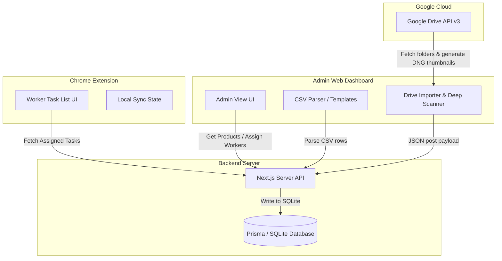

# 🚀 Buzl Fashion Helper: Ecosystem Documentation & Guide

Welcome to the **Buzl Fashion Helper** ecosystem—a high-productivity tool suite designed to optimize, automate, and streamline bulk Google Drive DNG importing and worker task assignment workflows for fashion photo post-processing operations.

This ecosystem is composed of three tightly coupled, highly efficient systems:
1. **Buzl Backend API** (`buzl-backend`): Next.js REST API with Prisma & SQLite.
2. **Admin Web Dashboard** (`buzl-fashion-helper-FULL_DEV`): Modern React / Vite administration dashboard.
3. **Worker Chrome Extension** (`Ext/buzl-fashion-helper`): Lightweight React / Vite Chrome Extension for workers.

---

## 📸 System Architecture & Data Flow



---

## 🛠️ Module Breakdown

### 1. ⚙️ Buzl Backend API (`buzl-backend`)
An ultra-fast Next.js-powered API layer that coordinates state updates, manages user session routing, and persists product metadata.

*   **Database Schema (`prisma/schema.prisma`)**:
    *   `User`: Represents administrators and workers.
    *   `Product`: Contains fields for product name, Google Drive folder link, reference links, status, notes, assignee relationships, and deep-scanned preview thumbnails (`thumbnail_url`). Includes auto-updating audit history fields (`last_action`, `createdAt`, `updatedAt`).
*   **Key API Endpoints**:
    *   `GET /api/products`: Retrieves all products and their assignees (accessible by both Admins and Workers).
    *   `POST /api/products`: Bulk creates or replaces products. Accepts `last_action` to differentiate Drive scans from CSV imports.
    *   `PATCH /api/products/[id]`: Multi-functional endpoint that logs actions (e.g. status updates, notes additions, worker assignments) to the `last_action` field.
    *   `DELETE /api/products`: Wipes out products (with confirmation safeguards).

---

### 2. 📊 Admin Web Dashboard (`buzl-fashion-helper-FULL_DEV`)
A high-premium React & Tailwind CSS application where administrators control the entire operational line.

*   **Advanced Google Drive Importer**:
    *   *Smart Parsing*: Instantly extracts IDs from all standard and deep-link folder formats (e.g., `/folders/ID`, `/file/d/ID`, `/d/ID`).
    *   *Recursive Traversal*: Recursively dives into subfolders to map complete file paths automatically.
    *   *Real-time Log Console*: Visually displays deep scanning progress to keep the admin informed.
    *   *DNG Preview Generation*: Deep-scans every subfolder, targets the first `.dng` (or image) file, and fetches its lightweight Google-generated preview thumbnail to save in the database.
    *   *Duplicate Check*: Automatically flags folders already present in the dashboard, unchecking them by default to prevent redundant uploads.
*   **Robust Administration Tools**:
    *   *Flexible Pagination*: Toggle display counts between **20, 30, 50, or ALL** products per page with fluid animations.
    *   *Multi-Column Sorting*: Click headers to sort by **Product Name, Status, and Last Action** (enabling easy sorting by Time and Source).
    *   *Bulk Processing*: Check products to assign them to workers in bulk, or bulk-delete them with one click.
    *   *CSV Helpers*: Instant template CSV generator and downloader.

---

### 3. 🔌 Worker Chrome Extension (`Ext/buzl-fashion-helper`)
A hyper-focused extension popup built in React & TypeScript that sits right in the workers' browser window.

*   **Garment Previews**: Renders the Google Drive-generated JPG preview thumbnail next to the checkbox, giving the worker an instant visual representation of the DNG garment task.
*   **Zero-Friction Utility**:
    *   Copy Product Name, Drive link, or Reference link with a single click.
    *   Directly open links in new tabs automatically.
    *   Live-editing notes field that auto-saves to the central server.
    *   Toggle task completion status directly from the card.

---

## 🚀 Installation & Local Development

### 1. Spin Up the Backend
1. Navigate to the backend directory:
   ```bash
   cd buzl-backend
   ```
2. Install dependencies:
   ```bash
   npm install
   ```
3. Set up the local SQLite database and sync schemas:
   ```bash
   npx prisma db push
   npx prisma generate
   ```
4. Start the Next.js development server:
   ```bash
   npm run dev
   ```
   *(Running locally on `http://localhost:3000`)*

### 2. Launch the Admin Dashboard
1. Navigate to the dashboard directory:
   ```bash
   cd buzl-fashion-helper-FULL_DEV
   ```
2. Install dependencies:
   ```bash
   npm install
   ```
3. Boot up the Vite server:
   ```bash
   npm run dev
   ```
   *(Running locally on `http://localhost:5173`)*

### 3. Compile & Load the Chrome Extension
1. Navigate to the extension folder:
   ```bash
   cd Ext/buzl-fashion-helper
   ```
2. Install dependencies and compile the production bundle:
   ```bash
   npm install
   npm run build
   ```
3. **Load in Chrome**:
   - Open Google Chrome and head to `chrome://extensions/`.
   - Toggle **Developer mode** (top right) to ON.
   - Click **Load unpacked** (top left).
   - Select the `Ext/buzl-fashion-helper/dist` directory.

---

## 🔒 Security & Environment Warnings

> [!WARNING]
> **API Keys Exposure**: The Google Drive API v3 key is currently stored inside client-side modules to support rapid deployment workflows. For production, it is highly recommended to move this key into Next.js Environment Variables (`.env.local`) and call the Google API via a secured Next.js server route to prevent API key scraping.

> [!IMPORTANT]
> **Production DB Migration**: The application is configured to run on an ephemeral SQLite file (`dev.db`). Before deploying to production hostings (Vercel, Render), you must swap the SQLite connection string in the backend `.env` file with a cloud-managed PostgreSQL connection string (e.g., Neon or Supabase) and run `npx prisma db push` to initialize it.
